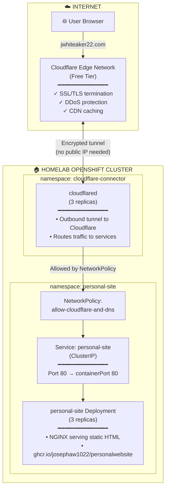

# Personal Website

A simple static website served by **NGINX**, containerized and hosted on a **homelab OpenShift cluster** with secure external access via **Cloudflare Tunnel**.

**Live at:** [jwhiteaker22.com](https://jwhiteaker22.com)

---

## Deploying To My Homelab OpenShift Cluster & Making It Publicly Accessible



## How It Works

**1. Domain & DNS**

The domain `jwhiteaker22.com` is registered and managed through Cloudflare's nameservers.


**2. Cloudflare Tunnel**

Instead of exposing the homelab cluster to the internet with a public IP, a `cloudflared` connector runs inside the cluster and establishes an outbound-only encrypted tunnel to Cloudflare's edge network. The tunnel routes are configured in Cloudflare Zero Trust to point `jwhiteaker22.com` to the internal Kubernetes service.


**3. Cloudflared Connector**

The `cloudflared` deployment runs in its own namespace and handles all inbound traffic from Cloudflare's edge network.


**4. Personal Site Deployment**

The NGINX deployment serves the static website content. Traffic is routed from `cloudflared` to the `personal-site` ClusterIP service.


**5. Network Security**

A Kubernetes NetworkPolicy restricts the `personal-site` namespace to only accept traffic from the `cloudflared` pods, with egress limited to DNS resolution.

**6. Zero Trust**

No ingress controllers, load balancers, or public IPs are needed on the cluster—all traffic flows through Cloudflare's secure tunnel.

---

## Deployment

Deploy to OpenShift with a single command:

```bash
./infra/okd-setup.sh
```

This script creates:
- The `personal-site` namespace/project
- A 3-replica NGINX Deployment
- A ClusterIP Service
- A NetworkPolicy restricting traffic to cloudflared only

---

## Local Development

Build and run locally with Podman/Docker:

```bash
# Build
podman build -t personalwebsite -f Containerfile .

# Run
podman run -p 8080:80 personalwebsite
```

Then visit http://localhost:8080
